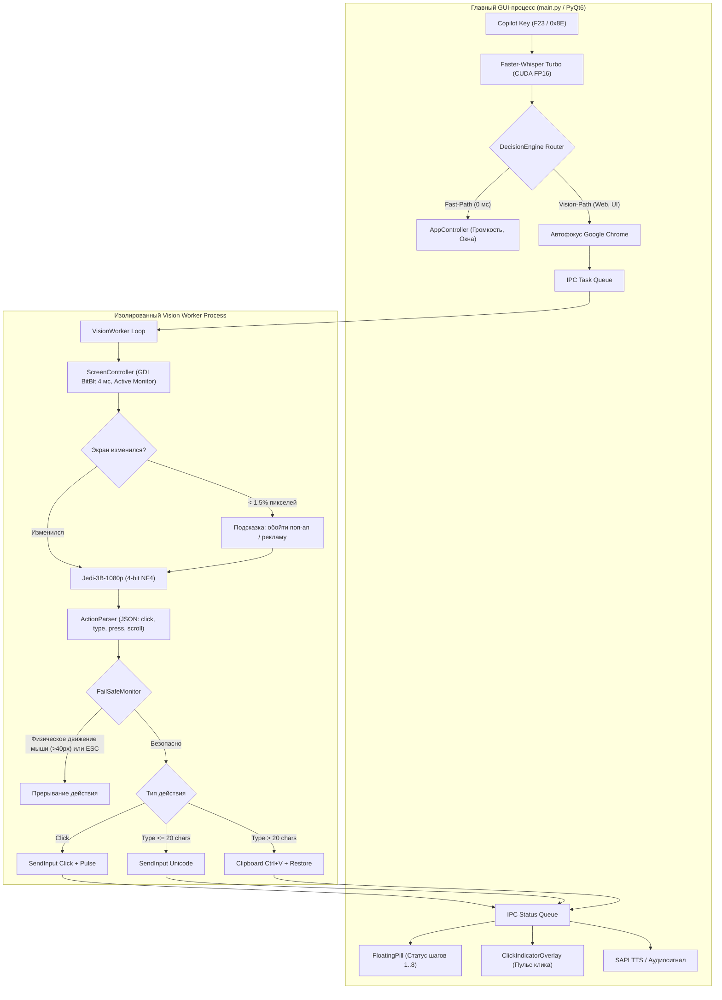

> [!NOTE]
> Данный файл содержит официальное техническое описание архитектуры, аппаратного профиля, стандартов разработки и регламентов валидации локального мультимодального ассистента **Antigravity Voice & Vision Assistant (Jarvis)**. Предназначен для ИИ-агентов и инженеров, развивающих кодовую базу проекта.

# Antigravity Voice & Vision Assistant (Jarvis) — System Architecture & Standards

Автономный локальный голосовой ассистент и мультимодальный агент компьютерного управления (**Computer-Use Agent**) для Windows 11 с нативной поддержкой аппаратной клавиши **Copilot** (`Shift + Win + F23`), распознаванием речи **Whisper Turbo** и аппаратным ускорением на видеокарте **NVIDIA GeForce RTX 5050 Laptop GPU (8 ГБ GDDR7)**.

---

## 1. Аппаратный профиль и бюджет видеопамяти (RTX 5050)

* **Графический процессор:** NVIDIA GeForce RTX 5050 Laptop GPU (7.93 ГБ доступной VRAM).
* **Оперативная память:** 16 ГБ RAM.
* **Двухпроцессная архитектура для изоляции VRAM и устранения конфликтов DLL:**
  * **Главный GUI-процесс (main.py):** Управляет аудиоконтуром, хуком Copilot, интерфейсом PyQt6 и движком распознавания речи `faster-whisper` (CUDA float16 через `ctranslate2 4.8.2`), занимая **~1.4–1.6 ГБ VRAM**.
  * **Изолированный Worker-процесс (core/vision_agent.py):** Запускает модель `xlangai/Jedi-3B-1080p` (или `Qwen/Qwen2.5-VL-3B-Instruct`) в 4-битном квантовании BitsAndBytes NF4, потребляя **~3.0–3.2 ГБ VRAM**. Отдельное адресное пространство полностью устраняет конфликт `cudnn_cnn64_9.dll` между PyTorch и CTranslate2.
  * **Windows DWM / Оконный менеджер:** ~1.0–1.2 ГБ VRAM.
  * **Суммарный бюджет VRAM:** **~5.0–5.5 ГБ из 8.0 ГБ** (гарантированный резерв >2.5 ГБ VRAM исключает OOM-падения).
* **Сброс VRAM до 0 МБ перед 3D-играми:** По нажатию «Остановить ассистента» в системном трее фоновый Worker-процесс немедленно завершается, а модель Whisper выгружается, освобождая 100% GPU-памяти.

---

## 2. Стек технологий

* **Среда выполнения:** Python 3.12 (изолированный `.venv` под управлением `uv`).
* **Глубокое обучение и инференс:**
  * `torch 2.11.0+cu128` и `torchvision 0.26.0+cu128` (CUDA 12.8).
  * `transformers >= 5.17.0`, `accelerate`, `bitsandbytes 0.50.2` (квантование 4-bit NF4).
  * `ctranslate2 4.8.2` (C++ оптимизированный движок инференса Whisper).
  * `huggingface_hub` (автоматическая и фоновая загрузка весов через `snapshot_download`).
* **Модели искусственного интеллекта:**
  * **STT (Распознавание речи):** `faster-whisper` (модель `turbo`) с аппаратным ускорением FP16 и VAD-фильтрацией тишины.
  * **Wake Word:** `openwakeword` (активация по слову-триггеру «Джарвис»).
  * **Vision Computer-Use:** `xlangai/Jedi-3B-1080p` (дериватив `Qwen2.5-VL-3B`, натренированный на 4 млн десктопных взаимодействий с разрешением 1080p и сохранением 100% кириллического OCR).
  * **Резервная VLM:** `Qwen/Qwen2.5-VL-3B-Instruct` (автоматический fallback при недоступности основной модели).
* **Слой взаимодействия с Windows 11:**
  * **Захват экрана:** Прямой Win32 GDI `BitBlt` (`core/screen_tools.py`) с задержкой **~4 мс** и сессией `WinSta0\Default`.
  * **Мультимониторность:** Динамическое определение активного монитора под курсором или окном приложения (`MonitorFromWindow` / `MonitorFromPoint`) с корректной денормализацией координат относительно физических смещений экрана (`left`, `top`).
  * **Гибридный ввод текста:** Unicode `SendInput` для коротких запросов (<=20 символов) + мгновенная вставка через буфер обмена (`Ctrl+V`) с сохранением буфера пользователя для длинных текстов (>20 символов).
  * **Автофокус Google Chrome:** Принудительный вывод `chrome.exe` на передний план за 0 мс перед выполнением веб-задач.
  * **Детекция изменений экрана:** Сравнение пикселей кадров (<1.5% порог изменения) для распознавания блокировки клика рекламой, поп-апами или баннерами cookie с подсказкой модели.
  * **Аварийный Fail-Safe:** Перехват `ESC` (0x1B) и физического смещения мыши (>40 px) для мгновенной остановки действий.
  * **Audio Ducking:** `pycaw` (Windows Core Audio API) — плавное приглушение звука до 20% во время записи речи.
  * **Перехватчик клавиатуры:** `pynput` с низкоуровневым `win32_event_filter` (Copilot VK_F23 = 0x8E / 0x86, маскирование меню Пуск через #MenuMaskKey 0xFF).
* **Пользовательский интерфейс (PyQt6):**
  * `MainWindow`: панель управления в теме Windows 11 Fluent Dark с карточками статуса и логами.
  * `FloatingPill`: плавающий статус-оверлей с динамическим шагом `[1/8] Анализирую экран...`.
  * `ClickIndicatorOverlay`: полупрозрачный неоновый пульсирующий маркер в точке клика (350 мс) без перехвата фокуса.
  * `SpotlightBar`: всплывающая строка поиска и ручного ввода команд (Hold Copilot).
  * `TrayManager`: иконка системного трея с полным управлением жизненным циклом VRAM.

---

## 3. Архитектура и межпроцессное взаимодействие



---

## 4. Структура кодовой базы

```text
localAgent/
├── config/
│   ├── settings.json              # Конфигурация (микрофон, триггер, TTS, vision_max_steps: 8, Chrome)
│   └── commands.json              # Реестр приложений, веб-алиасов и системных шорткатов
├── core/
│   ├── audio_listener.py          # Потоковый захват звука, VAD-фильтрация, Wake Word
│   ├── audio_ducking.py           # Audio Ducking через PyCAW
│   ├── speech_to_text.py          # Faster-Whisper Turbo на CUDA 12.8 с выгрузкой VRAM
│   ├── screen_tools.py            # GDI BitBlt (4 мс), мультимониторность, гибридный ввод, DPI
│   ├── vision_agent.py            # Ядро Computer-Use (Jedi-3B, Fail-Safe, очереди IPC, воркер)
│   ├── decision_engine.py         # Двухуровневый семантический роутер (Fast Path vs Vision Path)
│   ├── app_controller.py          # Управление окнами Windows (запуск, фокус, сворачивание)
│   ├── keyboard_hook.py           # Низкоуровневый перехватчик клавиши Copilot (F23 / 0x8E)
│   ├── text_to_speech.py          # Синтез голосовых ответов (TTS)
│   └── executor.py                # Исполнитель Win32, автофокус Chrome и интеграция с Vision-агентом
├── gui/
│   ├── main_window.py             # Панель управления с карточками статуса и логами
│   ├── floating_pill.py           # Плавающий оверлей статуса шагов и ClickIndicatorOverlay
│   ├── spotlight_bar.py           # Строка Spotlight (Hold Copilot / Alt+Space)
│   ├── close_dialog.py            # Диалог подтверждения («Свернуть в трей или выйти»)
│   ├── tray_manager.py            # Системный трей Windows с управлением VRAM в 0 МБ
│   └── styles.py                  # Fluent 2 Dark QSS стили
├── sounds/                        # Системные звуки (activate.wav, success.wav, error.wav)
├── tests/
│   ├── test_components.py         # Тесты роутера, экзекутора, громкости и окон (60+ тестов)
│   ├── test_screen_tools.py       # Тесты координатной сетки, мультимониторности и захвата
│   ├── test_vision_agent.py       # Тесты ActionParser, FailSafe и менеджера процессов
│   ├── test_cuda_stt.py           # Тест Faster-Whisper на CUDA
│   └── full_verification.py       # Сквозной валидационный аудит всех 9 подсистем (100% OK)
├── create_shortcut.py             # Создание тихого ярлыка на Рабочем столе
├── download_vision_model.py       # Фоновая загрузка весов Jedi-3B в кэш Hugging Face Hub
├── main.py                        # Главный координатор приложения (PyQt6)
├── pyproject.toml                 # Манифест зависимостей uv
├── README.md                      # Пользовательская документация
└── GEMINI.md                      # Архитектурное руководство (этот файл)
```

---

## 5. Стандарты разработки и регламент валидации

1. **Изоляция памяти:** Запрещено запускать тяжелые PyTorch-модели в главном GUI-процессе во избежание блокировки интерфейса и конфликта CUDA DLL с CTranslate2.
2. **Строгая типизация и плоская структура:** Обязательны тайп-хинтинги параметров и возвращаемых значений. Максимальная глубина вложенности кода — 3 уровня (использование Early Returns).
3. **Безопасность данных:** Опасные системные операции (выключение, перезагрузка, деструктивные действия) требуют явного подтверждения (`CONFIRM_REQUIRED`).
4. **Регламент валидации перед фиксацией:**

```powershell
# 1. Запуск полного сьюта unit-тестов (75 тестов, 100% PASS)
.\.venv\Scripts\python.exe -m unittest discover tests

# 2. Комплексная системная проверка всех 9 подсистем
.\.venv\Scripts\python.exe tests/full_verification.py
```
