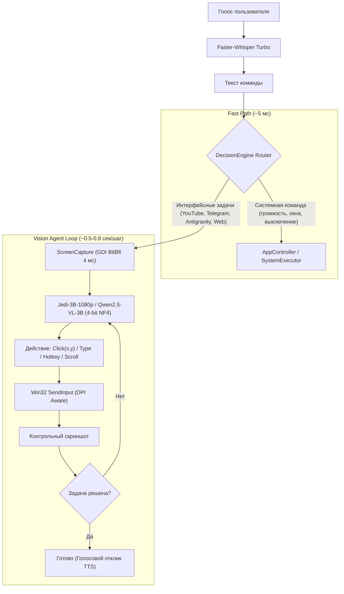

> [!NOTE]
> Данный файл содержит полное техническое описание архитектуры, аппаратного профиля, стандартов разработки и регламентов валидации локального мультимодального ассистента **Antigravity Voice & Vision Assistant (Jarvis)**. Предназначен для ИИ-агентов и инженеров, развивающих кодовую базу проекта.

# Antigravity Voice & Vision Assistant (Jarvis) — System Architecture & Standards

Автономный локальный голосовой ассистент и агент компьютерного управления (**Computer-Use Agent**) для Windows 11 с нативной поддержкой аппаратной клавиши **Copilot** (`Shift + Win + F23`), распознаванием речи **Whisper Turbo** и аппаратным ускорением на видеокарте **NVIDIA GeForce RTX 5050 Laptop GPU (8 ГБ GDDR7)**.

---

## 1. Аппаратный профиль и бюджет ресурсов (RTX 5050)

* **Графический процессор:** NVIDIA GeForce RTX 5050 Laptop GPU (7.93 ГБ доступной VRAM).
* **Оперативная память:** 16 ГБ RAM.
* **Бюджет VRAM в активном режиме ассистента:**
  * **Faster-Whisper Turbo:** ~1.4–1.6 ГБ VRAM (CUDA float16 через `ctranslate2 4.8.2`).
  * **Vision-Language Model (Jedi-3B-1080p / Qwen2.5-VL-3B в 4-бит NF4):** ~2.0 ГБ веса + ~1.0–1.2 ГБ KV-кэш и визуальные токены = **~3.0–3.2 ГБ VRAM**.
  * **Windows DWM / Оконный менеджер:** ~1.2–1.5 ГБ VRAM.
  * **Суммарное потребление:** **~5.5–6.0 ГБ VRAM** (гарантированный резерв >2 ГБ VRAM для исключения OOM).
* **Игровой режим:** Ассистент поддерживает полную выгрузку моделей из памяти до 0 МБ VRAM по команде или перед запуском тяжелых 3D-приложений.

---

## 2. Стек технологий

* **Среда выполнения:** Python 3.12 (изолированный `.venv` под управлением `uv`).
* **Глубокое обучение и инференс:**
  * `torch 2.11.0+cu128` и `torchvision 0.26.0+cu128` (CUDA 12.8).
  * `transformers >= 5.17.0`, `accelerate`, `bitsandbytes 0.50.2` (квантование 4-bit NF4).
  * `ctranslate2 4.8.2` (высокопроизводительный C++ бекенд для Whisper).
* **Модели искусственного интеллекта:**
  * **STT (Распознавание речи):** `faster-whisper` (модель `turbo`) с VAD-фильтрацией и подавлением галлюцинаций тишины.
  * **Wake Word:** `openwakeword` (активация по фразе «Джарвис»).
  * **Vision Computer-Use:** `xlangai/Jedi-3B-1080p` (специализированный дериватив `Qwen2.5-VL-3B`, натренированный на 4 миллионах интерфейсных действий с сохранением 100% кириллического OCR).
* **Слой взаимодействия с Windows:**
  * **Захват экрана:** Прямой Win32 GDI `BitBlt` (`core/screen_tools.py`) с привязкой к сессии `WinSta0\Default` (время кадра 1536x960 составляет 4 мс, DPI-Awareness per-monitor v2).
  * **Эмуляция ввода:** Win32 API `SendInput` с флагом `KEYEVENTF_UNICODE` (полная поддержка русской и английской раскладки без порчи буфера обмена) и `mouse_event`.
  * **Управление окнами:** `core/app_controller.py` (контроль процессов, предотвращение дублирования окон, фокус, сворачивание всех окон `Win+D`).
  * **Audio Ducking:** `pycaw` (Windows Core Audio API) — плавное приглушение звука системы во время речи.
  * **Перехватчик клавиатуры:** `pynput` с низкоуровневым системным фильтром `win32_event_filter` (коды `VK_F23 = 0x86`, маскирование Windows Search через `VK_CONTROL`).
* **Пользовательский интерфейс:** `PyQt6` (Windows 11 Fluent Dark тема, плавающий статус-оверлей, всплывающий Spotlight, системный трей).

---

## 3. Архитектурные принципы и маршрутизация (Sense-Plan-Act)



### Правила маршрутизации:
1. **Никаких тяжелых нейросетей на простые действия:** Команды вроде *«сделай громче»*, *«сверни всё»*, *«выключи звук»* отрабатывают за 5 мс через системный Win32 API.
2. **Никаких хрупких захардкоженных селекторов сайтов:** Ассистент не использует CDP или парсинг DOM конкретных ресурсов. Он видит интерфейс экрана и кликает как живой оператор.
3. **Безопасность действий:** Автономные клики, набор текста и навигация разрешены. Отправка сообщений в чатах и закрытие несохраненных окон запрашивают подтверждение пользователя.

---

## 4. Структура кодовой базы

```text
localAgent/
├── config/
│   ├── settings.json           # Пользовательские настройки (триггер, TTS, STT)
│   └── commands.json           # Системные сопоставления программ и алиасов
├── core/
│   ├── audio_listener.py       # Непрерывный захват микрофона, VAD, VU-метр, Wake Word
│   ├── audio_ducking.py        # Приглушение звука Windows (PyCAW)
│   ├── speech_to_text.py       # Faster-Whisper Turbo (CUDA 12.8)
│   ├── screen_tools.py         # Win32 GDI BitBlt захват экрана (4 мс), DPI scaling, мышь/клавиатура
│   ├── vision_agent.py         # Мультимодальный агент Computer-Use (Jedi-3B / Qwen2.5-VL)
│   ├── decision_engine.py      # Двухуровневый маршрутизатор (Fast Path vs Vision Path)
│   ├── app_controller.py       # Управление окнами Windows (WinSta0/Default, запуск, фокус)
│   ├── keyboard_hook.py        # Низкоуровневый перехватчик клавиши Copilot (F23)
│   ├── text_to_speech.py       # Синтезатор голосового отклика
│   └── executor.py             # Системный исполнитель Win32
├── gui/
│   ├── main_window.py          # Панель управления и логи
│   ├── floating_pill.py        # Плавающий статус-оверлей распознавания и кликов
│   ├── spotlight_bar.py        # Строка ввода команд Spotlight
│   ├── close_dialog.py         # Диалог выхода / сворачивания в трей
│   ├── tray_manager.py         # Иконка системного трея
│   └── styles.py               # Fluent 2 Dark QSS
├── sounds/                     # Аудиосигналы (activate, success, error)
├── tests/
│   ├── test_components.py      # Модульные тесты системных модулей (56 тестов)
│   ├── test_screen_tools.py    # Тесты захвата экрана и координатной сетки (6 тестов)
│   ├── test_cuda_stt.py        # Тест Faster-Whisper на GPU
│   └── full_verification.py    # Комплексная диагностика всех подсистем (100% OK)
├── create_shortcut.py          # Создание тихого ярлыка на Desktop
├── main.py                     # Главный координатор приложения
├── pyproject.toml              # Окружение uv
├── README.md                   # Руководство пользователя
└── GEMINI.md                   # Архитектурное руководство (этот файл)
```

---

## 5. Регламент валидации и запуска тестов

Каждое изменение в кодовой базе обязательно проверяется автоматизированным тест-сьютом:

```powershell
# 1. Запуск модульных тестов компонентов (56 тестов)
.\.venv\Scripts\python.exe -m unittest tests/test_components.py

# 2. Запуск тестов подсистемы экрана и ввода (6 тестов)
.\.venv\Scripts\python.exe -m unittest tests/test_screen_tools.py

# 3. Полный валидационный аудит всех 8 подсистем
.\.venv\Scripts\python.exe tests/full_verification.py
```
