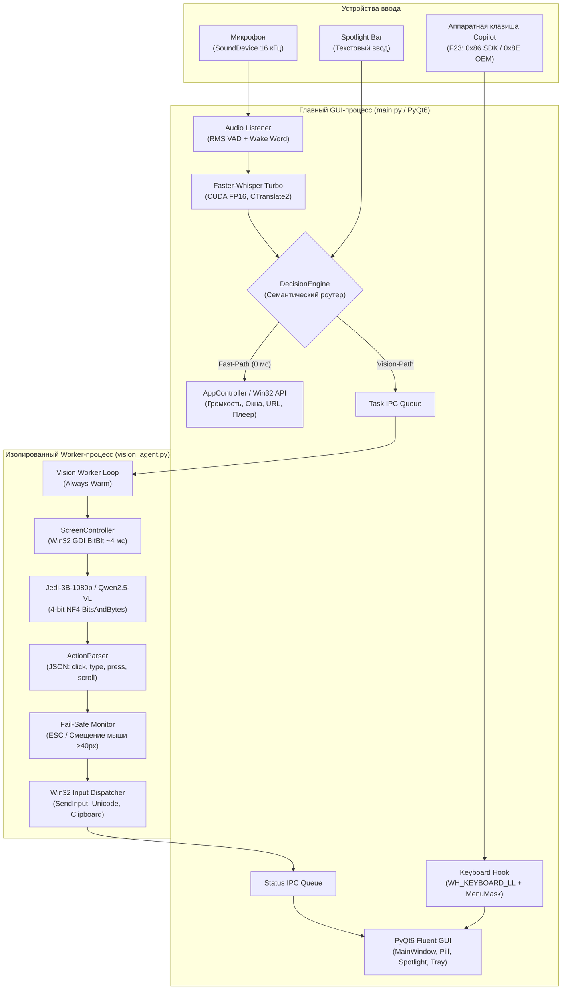

# 🎙️ Antigravity Voice & Vision Assistant (Jarvis)

<div align="center">


**Автономный локальный голосовой ассистент и мультимодальный агент компьютерного управления (Computer-Use Agent) для Windows 11.**

[Ключевые возможности](#-ключевые-возможности) •
[Голосовые команды](#-справочник-команд) •
[Архитектура](#-архитектура-системы) •
[Установка и запуск](#-установка-и-быстрый-старт) •
[Верификация](#-тестирование-и-верификация)

---

</div>

## 💡 О проекте

**Antigravity Voice & Vision Assistant** — это полностью локальная интеллектуальная операционная надстройка над Windows 11. Ассистент объединяет сверхбыстрое распознавание русской и английской речи (**Whisper Turbo**), аппаратную интеграцию с клавишей **Copilot** ноутбуков, мгновенное Win32-управление системой (0 мс задержки) и автономного мультимодального агента (**Jedi-3B / Qwen2.5-VL**), способного видеть экран рабочего стола и выполнять действия мышью и клавиатурой как человек.

Ассистент спроектирован для работы на видеокартах класса **NVIDIA GeForce RTX 5050 / 4060 / 3060 (бюджет VRAM ~5.5 ГБ из 8.0 ГБ)** с гарантированным сбросом памяти до **0 МБ** перед запуском 3D-игр.

---

## 🚀 Ключевые возможности

### 🎙️ 1. Голосовой контур и распознавание речи
* **Faster-Whisper Turbo на CUDA 12.8:** Локальный инференс с аппаратным ускорением FP16 через движок `ctranslate2`. Обработка 5 секунд русской речи занимает всего ~150–250 мс.
* **Двухступенчатая активация (Wake Word):** Быстрое RMS-детектирование акустической энергии + мгновенная локальная валидация фразы-триггера («Джарвис» или настраиваемое имя). Никаких тяжелых фоновых библиотек — 0 МБ лишней VRAM.
* **Интеллектуальный Audio Ducking:** Во время записи команды фоновый системный звук Windows (игры, музыка, браузер) плавно приглушается до 20% через Windows Core Audio API (`pycaw`), исключая наложение звуков из динамиков на микрофон.

### ⌨️ 2. Нативная интеграция с аппаратной клавишей Copilot и глобальные хоткеи
* **Низкоуровневый хук Win32:** Перехват комбинации `Shift + Win + F23` на уровне `WH_KEYBOARD_LL`. Поддерживает стандартные коды Windows SDK (`0x86`) и специфические OEM-коды клавиатур (`0x8E`).
* **Tap-to-Talk (клик):** Короткое нажатие активирует микрофон, издаёт мягкий звуковой сигнал и открывает плавающий индикатор.
* **Глобальные хоткеи:** Для клавиатур без физической клавиши Copilot поддерживается быстрый вызов `Ctrl+Space` (Tap-to-Talk), а также сочетания `Ctrl+Shift+J` и `Win+Shift+C`.
* **Spotlight Bar (удержание от 0.4 сек или Alt+Space):** По центру экрана появляется элегантная строка поиска и ввода текстовых команд в стиле macOS Spotlight / PowerToys Run с Live Auto-Suggestions автоподсказками на лету из `commands.json`, навигацией стрелками вверх/вниз и выбором по `Enter`.
* **Защита от конфликтов Windows:** Встроенный механизм маскирования клавиши Windows (`#MenuMaskKey = 0xFF`) полностью блокирует ложное всплывание системного меню «Пуск».

### 👁️ 3. Автономный Vision Computer-Use агент (Jedi-3B)
* **Зрение рабочего стола:** Сверхскоростной захват экрана через Win32 GDI `BitBlt` за **~4 мс** с автоматическим определением активного монитора (`MonitorFromWindow` / `MonitorFromPoint`) и DPI-масштабированием.
* **VLM в 4-битном квантовании (NF4):** Модель `xlangai/Jedi-3B-1080p` (дериватив Qwen2.5-VL-3B, обученный на 4 млн взаимодействий с десктопом) занимает всего **~3.2 ГБ VRAM**, понимает сложный интерфейс на русском языке и кликает с точностью до отдельных пикселей.
* **Изолированный Worker-процесс:** Нейросеть исполняется в отдельном фоновом процессе Windows, что полностью исключает блокировку графического интерфейса и решает конфликт библиотек `cudnn_cnn64_9.dll` между PyTorch и CTranslate2.
* **Детекция помех и баннеров:** Автоматическое сравнение кадров до и после действия: если интерфейс перекрыт cookie-баннером или рекламой, модель получает подсказку обойти препятствие.
* **Аварийный Fail-Safe:** Мгновенная остановка действий агента при нажатии клавиши `ESC` или физическом смещении мыши пользователем (>40 px).

### ⚡ 4. Двухуровневый маршрутизатор (Decision Engine)
* **Fast-Path (0 мс задержки):** Системные запросы (изменение громкости, пауза плеера, переключение окон, блокировка экрана, запуск программ, прямой запуск роликов на YouTube) исполняются моментально через прямое API без обращения к нейросети.
* **Vision-Path:** Сложные задачи навигации в интернете («Найди на Авито велосипед», «Включи на ютубе последнее видео Мармука», «В Озоне найди кофеварку») автоматически маршрутизируются в Vision-агента с предварительной навигацией на маркетплейсы (`avito.ru`, `ozon.ru`, `wildberries.ru`, `market.yandex.ru`).

### 🖥️ 5. Fluent 2 Dark интерфейс (PyQt6)
* **Главная панель:** Тёмная тема в стиле Windows 11 Fluent Design, карточки статуса устройств в реальном времени, поле смены слова-триггера, кнопка комплексной диагностики («Проверить все системы»), выпадающий селектор голосов Windows SAPI5 с кнопкой «🔊 Тест» и симулятор команд прямо в GUI.
* **FloatingPill (Плавающий оверлей):** Безрамочное окно поверх всех приложений, отображающее распознаваемый голос, статус шагов Vision-агента `[1/8] Анализирую экран...` и аудио-пульсацию синей точки в такт громкости голоса (RMS VU-метр).
* **ClickIndicatorOverlay:** Неоновый полупрозрачный пульсирующий маркер в точке клика ассистента (350 мс) с корректным масштабированием High DPI (`devicePixelRatio`), не перехватывающий фокус ввода.
* **Динамический системный трей:** Сворачивание при закрытии и динамическая иконка с 4 состояниями (`idle` — зелёный маркер активности, `listening` — пульсирующий огонёк записи речи, `working` — пульсирующий статус работы Vision-агента Jedi-3B, `stopped` — выгрузка VRAM в 0 МБ).

### 🛡️ 6. Безопасность и хранение моделей
* **Модальное подтверждение опасных действий:** Деструктивные операции (выключение, перезагрузка ПК) и запросы действий от Vision-агента (`ask_confirmation`) требуют обязательного модального подтверждения пользователем в GUI.
* **Безопасное исполнение PowerShell:** Запуск команд CLI выполняется в Windows Terminal / PowerShell через Base64 `-EncodedCommand` с параметром `shell=False`, полностью исключая уязвимости инъекции команд ОС.
* **Защита буфера обмена пользователя:** При вставке длинных текстов через clipboard исходное содержимое буфера обмена предварительно сохраняется в памяти и гарантированно восстанавливается в фоновом потоке.
* **Централизованное хранение весов:** Удалена рудиментарная папка `models/` в корне проекта — веса всех моделей загружаются напрямую в стандартный кэш Hugging Face Hub `~/.cache/huggingface/hub/`.

---

## 📋 Справочник команд

| Категория | Примеры голосовых фраз | Что происходит |
|---|---|---|
| **Громкость** | *«Сделай громкость 40%»*, *«Потише»*, *«Громче»*, *«Выключи звук»* | Мгновенное управление громкостью Windows через Core Audio API |
| **Медиаплеер** | *«Пауза»*, *«Продолжи воспроизведение»*, *«Следующий трек»* | Эмуляция аппаратных медиаклавиш Windows |
| **YouTube** | *«Включи видео котики»*, *«Поставь трек lofi hip hop»*, *«Найди на ютубе funny dogs»* | Прямой поиск первого ролика и немедленный запуск воспроизведения |
| **Окна Windows** | *«Сверни все»*, *«Покажи рабочий стол»*, *«Закрой блокнот»*, *«Разверни окно»* | Управление окнами приложений через Win32 User32 API |
| **Быстрые сайты** | *«Открой ютуб»*, *«Открой вк»*, *«Сообщения вк»*, *«Подписки на ютубе»* | Открытие прямых разделов в браузере по умолчанию |
| **Google Поиск** | *«Найди в гугле погода в Москве»*, *«Поищи курс доллара»* | Открытие страницы поиска Google |
| **Запуск ПО** | *«Открой блокнот»*, *«Запусти телеграм»*, *«Открой хром»* | Активация существующего окна или чистый запуск процесса |
| **Безопасность** | *«Заблокируй компьютер»*, *«Выключи пк»*, *«Перезагрузи ноутбук»* | Блокировка Win+L или выключение с запросом подтверждения |
| **Vision Агент** | *«На Авито найди квартиру в Москве»*, *«В Озоне найди наушники»*, *«Включи видео мармука на ютубе»* | Автономный анализ экрана, ввод текста в поисковые строки, клики по товарам |

---

## 🏗️ Архитектура системы



---

## ⚙️ Аппаратный профиль и бюджет VRAM

Тестирование и оптимизация производились на конфигурации:
* **GPU:** NVIDIA GeForce RTX 5050 Laptop GPU (8 ГБ GDDR7 VRAM).
* **RAM:** 16 ГБ DDR5.
* **ОС:** Windows 11 Pro 64-bit.

### Распределение видеопамяти:
| Компонент | Потребление VRAM | Примечание |
|---|---|---|
| **faster-whisper Turbo (CUDA FP16)** | ~1.4 – 1.6 ГБ | В главном процессе GUI |
| **xlangai/Jedi-3B-1080p (4-bit NF4)** | ~3.0 – 3.2 ГБ | В изолированном Worker-процессе |
| **Windows DWM / Оконный менеджер** | ~1.0 – 1.2 ГБ | Графическая подсистема Windows |
| **Суммарный расход** | **~5.4 – 5.8 ГБ** | **Запас >2.2 ГБ исключает OOM-сбои** |
| **Игровой режим (Остановить ассистента)** | **0 МБ** | 100% VRAM освобождается для 3D-игр |

---

## 📦 Установка и быстрый старт

### 1. Предварительные требования
* Windows 11 (64-bit).
* Видеокарта NVIDIA с поддержкой CUDA (от 6 ГБ VRAM).
* Установленный [Python 3.12](https://www.python.org/downloads/) или пакетный менеджер [`uv`](https://github.com/astral-sh/uv).

### 2. Клонирование и настройка окружения
```powershell
# Клонирование репозитория
git clone https://github.com/denis/antigravity-voice.git
Set-Location antigravity-voice

# Создание виртуального окружения Python 3.12
python -m venv .venv
.\.venv\Scripts\Activate.ps1

# Установка зависимостей
pip install -e .
pip install -e .[vision]
```

### 3. Загрузка весов Vision-модели (фоново)
Для работы автономного зрения необходимо загрузить веса `xlangai/Jedi-3B-1080p`:
```powershell
.\.venv\Scripts\python.exe download_vision_model.py
```

### 4. Создание ярлыка на рабочем столе
```powershell
.\.venv\Scripts\python.exe create_shortcut.py
```
На рабочем столе появится ярлык **`Antigravity Voice.lnk`**, настроенный на тихий запуск без всплывающего окна черной консоли (через `pythonw.exe`).

### 5. Запуск ассистента
```powershell
.\.venv\Scripts\python.exe main.py
```

---

## 🧪 Тестирование и верификация

Проект снабжён двухуровневой системой автоматизированного контроля качества:

### 1. Модульные тесты (Unit Tests)
```powershell
.\.venv\Scripts\python.exe -m unittest discover tests
```
> **Результат:** 142 из 142 тестов успешно пройдены (142/142 PASS, 100%), среднее время выполнения — 2.2 сек.

### 2. Сквозной валидационный аудит (End-to-End System Audit)
```powershell
.\.venv\Scripts\python.exe tests/full_verification.py
```
Проверяет все 10 этапов подсистем:
1. Стек зависимостей и окружение Python 3.12 (.venv).
2. Поддержку CUDA FP16 и CTranslate2 на видеокарте NVIDIA RTX 5050.
3. Звуковой контур (SoundDevice + PyCAW Audio Ducking).
4. Загрузку и выгрузку Faster-Whisper Turbo в CUDA со сбросом VRAM в 0 МБ.
5. Семантический маршрутизатор DecisionEngine (Fast-Path + GGUF API).
6. Исполнитель команд CommandExecutor (Antigravity GUI/CLI).
7. Низкоуровневый перехватчик клавиши Copilot (0x86 SDK / 0x8E OEM + Alt+Space / Ctrl+Space).
8. Графический интерфейс PyQt6 (MainWindow, QScrollArea, Pill, Spotlight, Tray).
9. Конфигурационные файлы (settings.json, commands.json).
10. Ярлык на рабочем столе (Antigravity Voice.lnk) и верификация Vision-агента (GDI BitBlt ~4 мс, ActionParser, FailSafe, изоляция PyTorch).

---

## 📄 Распространение

Свободное распространение (Free / Open Source).
