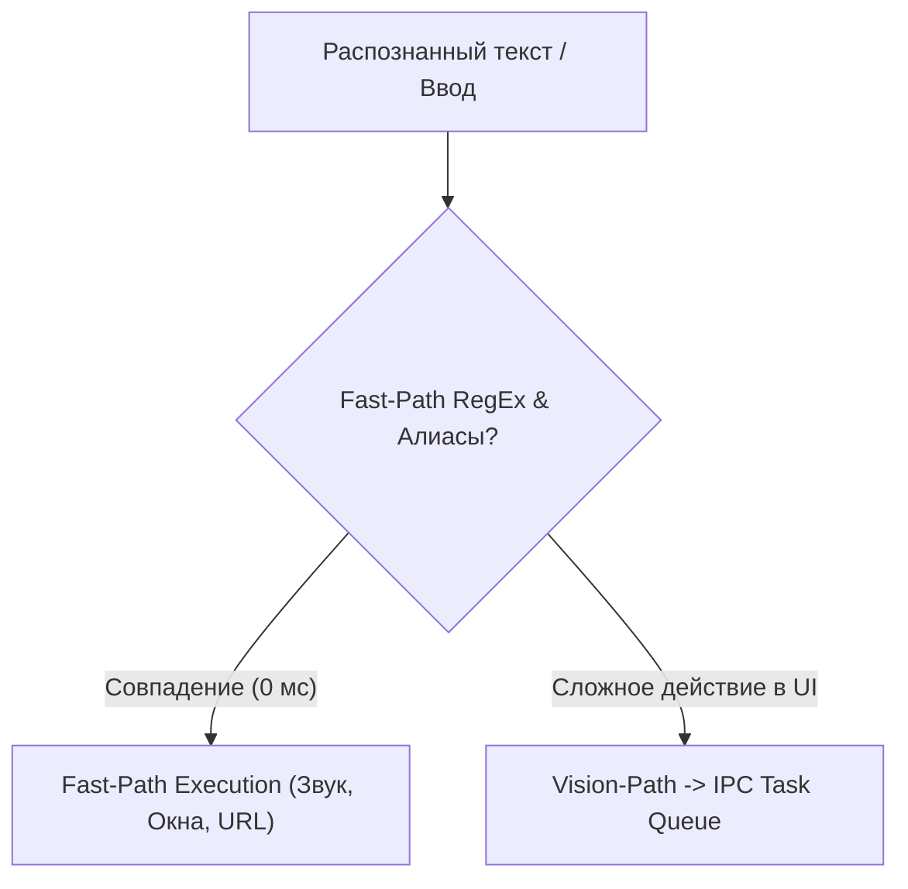

> [!NOTE]
> **Назначение документа:** Спецификация межпроцессных контрактов (IPC), очередей сообщений и семантического маршрутизатора DecisionEngine. Документ регламентирует протокол взаимодействия между главным GUI-процессом и изолированным воркером компьютерного зрения.

# Архитектура API, IPC и Маршрутизации

Система использует строгое разделение задач: синхронный Fast-Path маршрутизатор в главном процессе и асинхронный двунаправленный протокол очередей IPC (`multiprocessing.Queue`) для взаимодействия с воркером зрения.

---

## 1. Маршрутизатор DecisionEngine

Класс [`DecisionEngine`](file:///c:/Users/denis/Documents/antigravity/localAgent/core/decision_engine.py) выполняет мгновенную двухступенчатую классификацию входящих текстовых команд:



### Формат результата маршрутизации:
```python
@dataclass
class RouteDecision:
    action_type: str        # 'launch_app' | 'open_url' | 'set_volume' | 'antigravity_gui' | 'vision_task'
    payload: dict[str, Any] # Параметры команды (URL, путь к exe, уровень громкости, исходный текст)
    is_vision: bool         # True, если требуется анализ экрана через Jedi-3B
```

---

## 2. Протокол очередей IPC (Inter-Process Communication)

Главный GUI-процесс и процесс-воркер обмениваются данными через две потокобезопасные очереди:
1. **`task_queue` (Main -> Worker):** Передача команд на выполнение действий компьютерного управления.
2. **`status_queue` (Worker -> Main):** Передача прогресса выполнения, статусов разогрева модели и координат для отрисовки UI-маркеров.

### Контракт `task_queue` (Входящие задачи):
```python
{
    "type": "start_task",               # "start_task" | "cancel" | "warmup" | "shutdown"
    "instruction": "найди видео на youtube", # Строка пользовательской инструкции
    "max_steps": 8                      # Максимальный лимит шагов (1..15)
}
```

### Контракт `status_queue` (События и обратная связь):
```python
# 1. Прогресс загрузки модели в VRAM:
{
    "type": "warmup_progress",
    "status": "loading" | "ready" | "error",
    "message": "Загрузка Jedi-3B в GPU..."
}

# 2. Очередной шаг выполнения Computer-Use:
{
    "type": "step_update",
    "step": 1,
    "max_steps": 8,
    "action": "click",                  # "click" | "type" | "press" | "scroll" | "wait" | "finish"
    "coord": [960, 540],                # [x, y] абсолютные физические координаты клика
    "thought": "Кликаю по строке поиска Google Chrome"
}

# 3. Завершение задачи:
{
    "type": "task_completed",
    "success": True,
    "message": "Задача успешно выполнена"
}

# 4. Прерывание аварийным Fail-Safe (движение мыши или ESC):
{
    "type": "task_aborted",
    "reason": "fail_safe_triggered"
}
```

---

## 3. Сигналы пользовательского интерфейса (PyQt6)

События из очереди `status_queue` считываются фоновым `QThread` и транслируются в GUI через типизированные сигналы:
- `step_progress_signal(int, int, str)` -> Обновление плашки [`FloatingPill`](file:///c:/Users/denis/Documents/antigravity/localAgent/gui/floating_pill.py).
- `click_marker_signal(int, int)` -> Отрисовка пульсирующего маркера [`ClickIndicatorOverlay`](file:///c:/Users/denis/Documents/antigravity/localAgent/gui/floating_pill.py).
- `tray_state_signal(str)` -> Смена иконки трея (`idle`, `listening`, `working`, `stopped`).
- `worker_log_signal(str)` -> Вывод логов воркера в консоль [`MainWindow`](file:///c:/Users/denis/Documents/antigravity/localAgent/gui/main_window.py).
